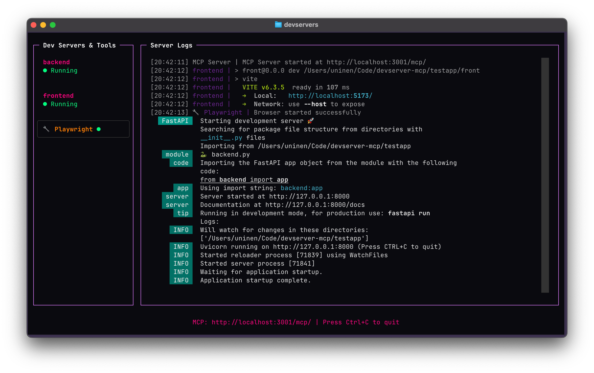

# DevServer MCP

A Model Context Protocol (MCP) server that manages development servers for LLM-assisted workflows. Provides programmatic control over multiple development servers through a web-based interface with real-time log streaming.



## Project Status

This is both **ALPHA** software and an exercise in vibe coding; most of this codebase is written with the help of LLM tools.

The tests validate some of the functionality and the server is already useful if you happen to need the functionality but YMMV.

## Features

- 🚀 **Process Management**: Start, stop, and monitor multiple development servers
- 🌐 **Web Interface**: Beautiful web UI with real-time log streaming via WebSocket
- 📊 **Multi-Project Support**: Manage servers across multiple projects simultaneously
- 🔧 **LLM Integration**: Full MCP protocol support for AI-assisted development workflows
- 🔒 **Auto-Discovery**: MCP clients automatically find and connect to running manager
- ⚡ **Auto-Start**: Manager starts automatically when accessed by MCP clients

## Installation

```bash
uv add --dev git+https://github.com/Uninen/devserver-mcp.git --tag v0.6.0
```

## Quick Start

Create a `devservers.yml` file in your project root:

```yaml
project: my-app  # Required: unique project identifier

servers:
  backend:
    command: 'python manage.py runserver'
    working_dir: '.'
    port: 8000
    autostart: true

  frontend:
    command: 'npm run dev'
    working_dir: './frontend'
    port: 3000
    autostart: true

  worker:
    command: 'celery -A myproject worker -l info'
    working_dir: '.'
    prefix_logs: false
```

## Configuration

The MCP server automatically starts the DevServer Manager when accessed, so no manual startup is required.

### VS Code

Add to `.vscode/mcp.json`:

```json
{
  "servers": {
    "devserver": {
      "command": "uvx",
      "args": ["devserver-mcp"]
    }
  }
}
```

### Claude Code

Install the server locally:

```bash
claude mcp add devserver-mcp uvx devserver-mcp
```

Or for a specific project (saves to `.mcp.json` in the project):

```bash
claude mcp add -s project devserver-mcp uvx devserver-mcp
```

### Gemini CLI

Add the server configuration in `settings.json` (`~/.gemini/settings.json` globally or `.gemini/settings.json` per project):

```json
{
  "mcpServers": {
    "devservers": {
      "command": "uvx devserver-mcp"
    }
  }
}
```

### Zed

Add to your Zed config:

```json
{
  "context_servers": {
    "devservers": {
      "command": {
        "path": "uvx",
        "args": ["devserver-mcp"]
      }
    }
  }
}
```

## Usage

### CLI Commands

```bash
# Show status and help
devservers

# Start the manager server
devservers start

# Start manager + specific project servers
devservers start my-app

# Open web UI (starts manager if needed)
devservers ui

# Stop the manager and all servers
devservers stop
```

### Web Interface

Access the web UI at http://localhost:7912 when the manager is running. Features include:

- Project dashboard with server status cards
- Real-time log streaming via WebSocket
- Start/stop controls for each server
- Log search and filtering
- Multiple project support

### MCP Tools Available

The server exposes the following tools for LLM interaction:

1. **list_projects()** - List all registered projects
2. **start_server(name, project_id)** - Start a server (uses current directory's project if not specified)
3. **stop_server(name, project_id)** - Stop a running server
4. **get_server_logs(name, project_id, lines)** - Get recent server logs

## Developing

### Using MCP Inspector

1. Start MCP Inspector: `npx @modelcontextprotocol/inspector uvx devserver-mcp`
2. The MCP server will auto-start the manager if needed

### Running Tests

```bash
uv run pytest
```

## Elsewhere

- Follow [unessa.net on Bluesky](https://bsky.app/profile/uninen.net) or [@uninen on Twitter](https://twitter.com/uninen)
- Read my continuously updating learnings from Vite / Vue / TypeScript and other Web development topics from my [Today I Learned site](https://til.unessa.net/)

## Contributing

Contributions are welcome! Please follow the [code of conduct](./CODE_OF_CONDUCT.md) when interacting with others.
