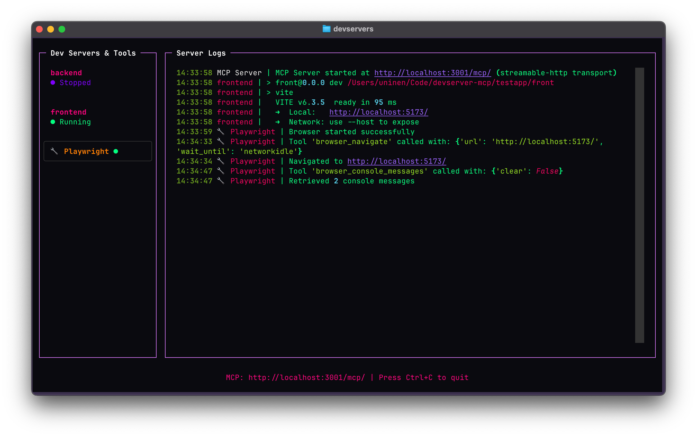

# DevServer MCP

A Model Context Protocol (MCP) server that manages development servers for LLM-assisted workflows. Provides programmatic control over multiple development servers through a unified interface with a simple TUI, plus experimental browser automation via Playwright.

You can also turn the servers on and off by clicking via the TUI.



## Project Status

This is both **ALPHA** software and an exercise in vibe coding; most of this codebase is written with the help of LLM tools.

The tests validate some of the functionality and the server is already useful if you happen to need the functionality but YMMV.

## Features

- 🚀 **Process Management**: Start, stop, and monitor multiple development servers
- 📊 **Rich TUI**: Interactive terminal interface with real-time log streaming
- 🌐 **Browser Automation**: Experimental Playwright integration for web testing and automation
- 🔧 **LLM Integration**: Full MCP protocol support for AI-assisted development workflows

## Installation

```bash
uv add git+https://github.com/Uninen/devserver-mcp.git
```

## Configuration

Create a `devservers.yml` file in your project root:

```yaml
servers:
  backend:
    command: 'python manage.py runserver'
    working_dir: '.'
    port: 8000

  frontend:
    command: 'npm run dev'
    working_dir: './frontend'
    port: 3000

  worker:
    command: 'celery -A myproject worker -l info'
    working_dir: '.'
    port: 5555

# Optional: Enable experimental Playwright browser automation
experimental:
  playwright: true
```

Add MCP configuration for your editor:

```json
// .vscode/mcp.json
{
  "servers": {
    "devserver": {
      "url": "http://localhost:3001/mcp/",
      "type": "http"
    }
  }
}
```

## Usage

### Running the MCP Server

Start the TUI:

```bash
devservers
```

Now you can watch and control the devservers and see the logs while also giving LLMs full access to the servers and their logs.

### MCP Tools Available

The server exposes the following tools for LLM interaction:

#### Server Management

1. **start_server(name)** - Start a configured server
2. **stop_server(name)** - Stop a server (managed or external)
3. **get_server_status(name)** - Get server status
4. **get_server_logs(name, lines)** - Get recent logs from managed servers

#### Browser Automation (Experimental)

When `experimental.playwright` is set in config:

1. **browser_navigate(url, wait_until)** - Navigate browser to URL with wait conditions
2. **browser_snapshot()** - Capture accessibility snapshot of current page
3. **browser_console_messages(clear)** - Get console messages with optional clear

## Developing

### Using MCP Inspector

1. Start the server: `devservers`
2. Start MCP Inspector: `npx @modelcontextprotocol/inspector http://localhost:3001`

### Scripting MCP Inspector

1. Start the server: `devservers`
2. Use MCP Inspector in CLI mode, for example: `npx @modelcontextprotocol/inspector --cli http://localhost:3001 --method tools/call --tool-name start_server --tool-arg name=frontend`

## Elsewhere

- Follow [unessa.net on Bluesky](https://bsky.app/profile/uninen.net) or [@uninen on Twitter](https://twitter.com/uninen)
- Read my continuously updating learnings from Vite / Vue / TypeScript and other Web development topics from my [Today I Learned site](https://til.unessa.net/)

## Contributing

Contributions are welcome! Please follow the [code of conduct](./CODE_OF_CONDUCT.md) when interacting with others.
